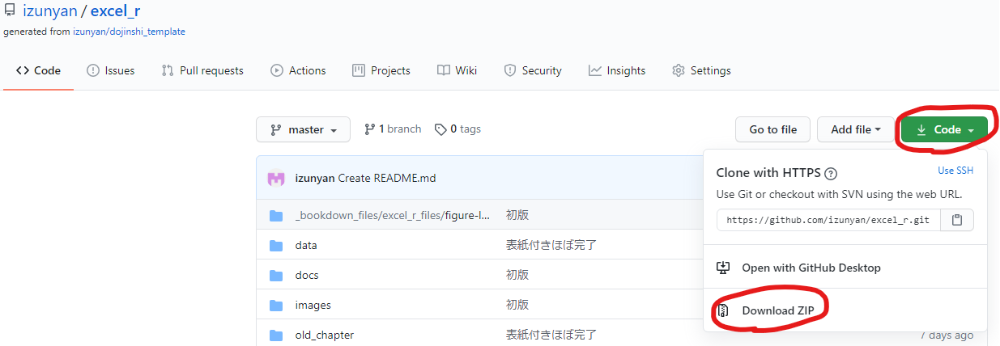
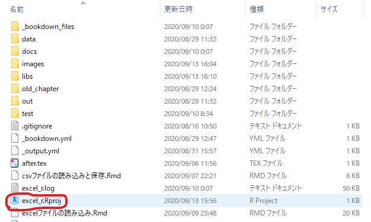
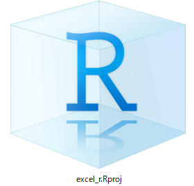

# Rで読むExcelファイル
* 技術書典9で頒布した本を作成したレポジトリです。
* 以下の図中の赤丸のところをクリックして手順でダウンロードして解凍してください
  - 解凍とは、ダブルクリックして開くだけじゃないです、`右クリック＞すべて展開`です！

* 開いたフォルダ内の青い立方体アイコンの`excel_r.Rproj`をダブルクリックして実行すれば、RStudioが立ち上がり、本書のコードがそのまま実行できます
  - `.Rproj`が出てなくて`excel_r`とだけ表示されてる人もいるかも

* 立方体アイコンを拡大するとこれです
  - メニューから`表示＞レイアウト＞特大アイコン`で見つけられるかも

