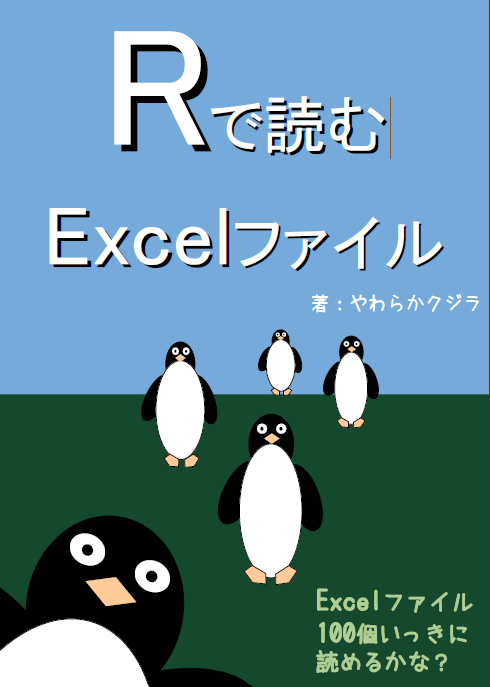

```{r setup, include=FALSE}
knitr::opts_chunk$set(echo = TRUE, warning = FALSE, message = FALSE,
                      dev = "cairo_pdf", dev.args = list(family = "ipaexg")) # pdfでggplot2の日本語出力に必要な設定→html不可？

# tibbleの表示行数指定
tibble_opt <- list(
  "tibble.print_min" = 3, # 表示する行の数
  "tibble.width" = 65     # 横の表示幅
)

options(tibble_opt)

```

# はじめに {-#hajimeni}

```{r cover, echo=FALSE, fig.align='center', out.width='60%'}

```

* 本webサイトは，技術書典9にて頒布した[Rで読むExcelファイル](https://techbookfest.org/product/4794168259903488?productVariantID=5913872206659584)のオンラインバージョン
* こちらは随時updateされていく予定
* csvファイルの読み込み部分について，R4.2に対応させました（2022/05/03）

本書『**Rで読むExcelファイル**』を書こうと思ったのは「RとRStudioを使いたい！と思う人がもっと増えればいいのに」という願いからです。使う人が多くなれば、新しい知識に出会いやすくなりますし、仕事でも使う機会が増える可能性があります。

使う人を増やすためにはよい入門書やwebサイトが必要ですが、それは巷にあふれていて無料でアクセスできるものも多いです。

例えば

 * [R for Data Science](https://r4ds.had.co.nz/)（英語） ^[https://r4ds.had.co.nz/]  
 * [日本社会心理学会　第5回春の方法論セミナー　RとRstudio入門](https://kazutan.github.io/JSSP2018_spring/index.html) ^[https://kazutan.github.io/JSSP2018_spring/index.html]
 

そこで本書では目的を絞って、R（実際はすべてRStudioから使います）を使いたいと思わせる部分を解説することを目指します。Rでどんな便利なことができるか、入門書などでもあまり深く解説されてない部分にフォーカスして紹介します。


## 本書の特徴 {-}
便利なことといってもいろいろあるので、その中でも、つまづくと嫌になってしまうことの多そうな、**「手元のExcelファイルを読み込む」**所に着目しました。このトピックだけをRのいわゆるモダンな方法を使って重点的に解説した資料は、筆者の知る範囲では見つけられてないので、本書の最も際立った特徴といえます。また、関連するファイル形式として、csvファイルの読み書きも少しだけ触れています。こちらはつまづくことの多いであろう文字コードについても解説しました。

解析したいデータが、綺麗な一つにまとまったデータばかりとは限りません。たとえば、会社の部署ごとに分かれたデータなど、解析に持っていくまでに大量のファイルを読みこまなければいけない場合もあります。その読み込みの際にいかに楽をできるかという点を意識しています。データさえスムーズに読み込めれば、後はすぐれた解説がネット上でもたくさんあり、やりたいことが可能になる環境が整うからです。

Excelファイルをただ読みこむといってもいろんなバリエーションが考えられます。その単なる読みこみプロセスを通じて、Rを使う上で便利な関数や手続きを学ぶこともできるでしょう。**戦いの中で自然に強くなった的な効果**も見込めるかもしれません。

本書の内容は、githubレポジトリの https://github.com/izunyan/excel_r ですべて公開しています。コードやサンプルデータはこちらのレポジトリをダウンロードしてお試しください。pdf版が読みたい方は、以下のページで無料で入手可能です。自力でできる方は、`Build Book`でも作成できます。

* [技術書典マーケットの販売ページ](https://techbookfest.org/product/4794168259903488?productVariantID=5913872206659584)
  + https://techbookfest.org/product/4794168259903488?productVariantID=5913872206659584

### 想定読者 {-}
色々なExcelファイルを読み込んで分析する機会があるのであれば、全くRのことを知らない方から、少しRの経験があるけど複数のファイルを一度に読みこんだことはないというレベルの方ぐらいまでが対象となるでしょう。

本書の到達目標は、RでのExcelファイルの読み書きレベルをある程度高める、という所に定めました。その先は是非好きなように可視化なり解析なり進めていただければと思います。とはいえ、そこでお好きなように！と言われても路頭に迷う方もいるかもしれないので、データの内容把握に関して、要約値や欠損値の一覧、簡単な可視化、相関の一覧についても少しだけ解説しました。その一助として、特別付録として本書と並行してまとめた、可視化のための[ggplot2の辞書](https://izunyan.github.io/practice_ggplot2/)（[特別付録について](#huroku)参照）もあります。

なお、データをきれいにする過程（例：前処理、データクリーニング、データクレンジング、データラングリングなど）については多くの説明を要するため、本書の範囲を超えます。これはまた別機会にまとめられたらなと思っています^[基本の一部ですが，まとめました『がんばらないデータ加工　Rによるくり返し作業入門　前編』 (https://izunyan.github.io/gisho12/)]。

### 本書の構成 {-#structure} 
まず\@ref(project)章では、RStudioでファイルを読み書きする際に、最低限知っておいた方がよい知識について解説しておきます。とっつきにくいかもしれませんが、知っておいてよかったと後になって実感する類のものなので、使って慣れていきましょう。  

\@ref(readexcel)章は本書のメインであるExcelファイルの読み込みについて解説します。一つのファイルの読み込みから、複数シート、複数ファイルの読み込みまで、様々なシーンに対応しました。また、読みこんだファイルを一つのデータフレーム^[変数（列）とオブザベーション（行）が碁盤の目のようになった集まりの形のデータ。Excelであれば通常1行目に列名が入り、2行目以降が個別のデータを表す。データ解析において便利で分かりやすいため、本書ではデータフレームの形で説明していく]にまとめる方法についても触れています。  

\@ref(writeexcel)章はExcelファイルの保存についてです。ここでも、一つのファイルの保存から、複数ファイルの保存まで解説します。ここまでの内容が理解できれば、大量ファイルの読み書きにまつわる単純な繰り返し作業とはさよならできるでしょう。  

\@ref(readsavecsv)章は関連知識としてcsvファイルの読み込みと保存について解説します。windowsユーザーは文字コードの違いによる文字化けというつらみと対峙することになり、初学者はここで脱落していくことが多いのではないかと思います。そのために、サバイバルスキルとして知っておくことが有用だと思い書いておきました。自分が相当苦しんだので…  

\@ref(dataanal)章は、読み込んだファイルの特徴をざっと把握する方法について解説しました。ここまでやれば、（きれいなデータであれば！）きっとデータ解析に入っていくことができるでしょう。

### 執筆環境 {-}
* 本書は[bookdown](https://bookdown.org/)にて執筆しました ^[https://bookdown.org/]

* Rおよびパッケージのバージョン（オンライン版）


```{r echo = FALSE}
# library(tidyverse)
# library(writexl)
# library(janitor)

res_si <- 
   sessioninfo::session_info()

res_si$platform |>
  stack() |>
  tibble::as_tibble() |>
  dplyr::relocate(ind) |>
  dplyr::mutate(ind = as.character(ind)) |>
  dplyr::filter(ind %in% c("version", "os", "system", "date", "rstudio")) |>
  print(n = 10)
# |> 
#   # head(5) |>
#   knitr::kable() |> 
#   kableExtra::kable_styling(position = "center")

res_si$packages |> 
  tibble::as_tibble() |> 
  dplyr::select(package, loadedversion) |> 
  dplyr::filter(package %in% c("bookdown", "tidyverse", "readxl","writexl"))
# |>
#   knitr::kable() |> 
#   kableExtra::kable_styling(position = "center")
```

* RStudioのバージョン
  + ‘2022.2.1.461’（手動で記入）


```{r eval=FALSE, include=FALSE}
rsinfo <- 
rstudioapi::versionInfo()

rsinfo$version
```


## 注意事項など {-}
* 本書の内容はすべてwindows環境を想定しています。

* この本に書いてある内容は、筆者が学習したことをまとめているものにすぎないため、正常な動作の保証はできません。使用する際は、自己責任でお願いします。 


## 特別付録について {-#huroku}

本書の執筆に先駆けて、順序が違う気がしますがまず付録の作成からはじめました。特別付録は以下でアクセス可能なオンライン付録となります。     
     
* [ggplot2の辞書](https://izunyan.github.io/practice_ggplot2/)    
  + https://izunyan.github.io/practice_ggplot2/    
     
Twitterで応援してもらったら項目が増えていく仕様にしているので、もっと読みたい方は[こちらのツイート](https://twitter.com/matsuchiy/status/1277621662708453377)に何らかのレスポンスください！       
       
       
******  
          
      