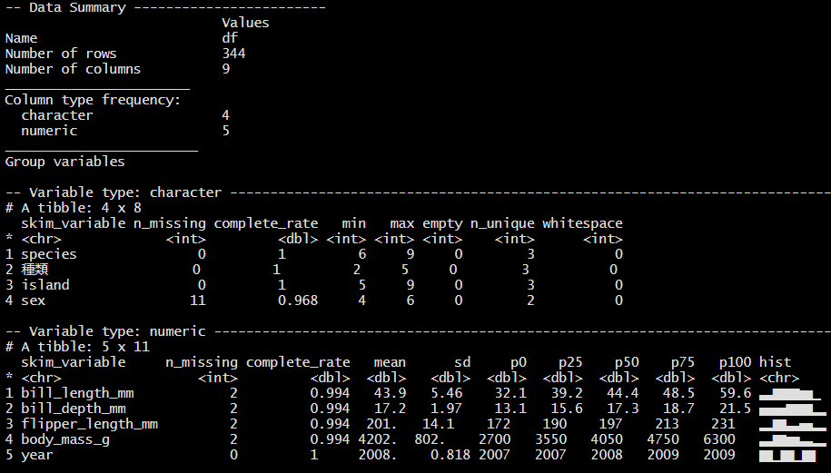

```{r eval=FALSE, include=FALSE}
#メモ用チャンク

# (PART) Excelファイルを保存する {-#writingexcel}
これはhtml用

```

# データ解析に向けて {#dataanal}
ここまでの解説で、Excelファイルとcsvファイルの読み込みについて一通り解説してきました。この段階では、まだデータがきれいでなくて、解析に入れないことも多いと思います。


## 要約値や欠損データの確認 {#dataanal-summarizemissing}
まずどんなデータがどのように入っているか、欠損値（NA）はどれくらい発生しているか確認することは重要なプロセスです。変数の一覧を要約して確認することが簡単にできる`skim`パッケージの`skimr()`関数を使って確認してみましょう。データは\@ref(junbiyomikomi)で読み込んだ`df`を使います。


```{r skimr}
library(skimr) # version 2.1.2
```

```{r eval = FALSE}
skim(df)
```

(ref:skim) skim()の出力

```{r skim, echo=FALSE, fig.align='center', fig.cap='(ref:skim)', out.width='80%'}

```

データの型が数値である変数（ここでは`Variable type:numeric`）については、`hist`列に簡単なヒストグラムが表示されます（図\@ref(fig:skim)）。しかしデータが大量な場合、動作が遅くなります。その場合は、ヒストグラムを描かない以下の関数が使えます。

```{r eval = FALSE}
skim_without_charts(df)
```

### 結果をExcelファイルに出力する {#dataanal-outexcel}

`as_tibble()`関数を使うことで、結果を一つのデータフレームにまとめることができます。

```{r}
res_skim_df <- 
skim(df) |> 
  as_tibble()

res_skim_df |> 
  head()        # 最初の6行を表示
```

これで好きなように加工してExcelファイルとして出力することが可能になります。例えば、数値変数だけに絞る場合は

```{r}
res_skim_df |> 
  filter(skim_type  == "numeric") |> 
  select(skim_type, skim_variable,
         n_missing, numeric.mean, numeric.sd)
```

また、`group_by()`を使ってグループ別に上記結果を出すことも可能です。

```{r}
res_df_num_g <- 
df |> 
  group_by(種類) |> 
  skim() |> 
  as_tibble() |> 
  filter(skim_type  == "numeric") |> 
  select(skim_type, skim_variable, 種類,
         n_missing, numeric.mean, numeric.sd)

res_df_num_g
```

あとは、以下のように出力するだけです。

```{r eval = FALSE}
write_xlsx(res_df_num_g, "out/種類別平均値（全数値型変数）.xlsx")
```


### 可視化 {#dataanal-visualize}
さらに`ggplot2`を使って可視化することも可能になります。

```{r fig.width = 5, fig.height = 4}
res_df_num_g |> 
  filter(skim_variable %in% c("bill_length_mm", "bill_depth_mm",
                             "flipper_length_mm", "body_mass_g")) |> 
  ggplot(aes(x = 種類, y = numeric.mean, fill = 種類)) +
   geom_col() +
    theme(axis.text.x = element_text(size = 5)) +
   facet_wrap(vars(skim_variable), scale = "free")
```

ただし、ここの場合もっと潤沢な可視化グラフは元データから作成できます。例えば

```{r fig.width = 4, fig.height = 3}
df |> 
  select(種類, bill_length_mm, bill_depth_mm, flipper_length_mm,
         body_mass_g) |> 
  pivot_longer(-種類,                  # wideデータからlongデータに変換
               names_to = "variables",
               values_to = "scores") |> 
  ggplot(aes(x = 種類, y = scores, fill = 種類)) +
   geom_boxplot(alpha = 0.3, width = 0.3) + # 箱ひげ図
   geom_violin(alpha = 0.3) +               # バイオリンプロット
    theme(axis.text.x = element_text(size = 5)) +
   facet_wrap(vars(variables), scales = "free")
```


詳しくは特別付録の[ggplot2の辞書](https://izunyan.github.io/practice_ggplot2/)を参照ください。


## 相関の確認 {#dataanal-cor}
変数同士の相関関係を見たいという要望はビジネス、アカデミックを問わず多く発生すると思います。簡単な相関行列の出し方やその可視化について解説します。ここで便利なパッケージが`corrr`です。

### 相関行列を出す {#dataanal-cormatr}
```{r}
library(corrr)
```

まずペンギンデータの中の数値変数だけにしぼります。そして、yearはここでは不要なので落とします。そうして作ったデータフレーム`cor_df`を、`correlate()`関数に入れるだけです。

```{r}
cor_df <- 
df |> 
  select(where(is.numeric)) |> # 数値変数だけにしぼる
  select(!year)                 # 不要なので落とす  


correlate(cor_df)
```

上側と下型で相関係数が重複しているので、片側だけを残したい場合があります。その際は`shave()`関数で簡単に重複部分をなくせます。引数に`upper = FALSE`と入れれば、上側だけにすることもできます。

相関係数の表示したい桁の指定は、`fashion()`関数で、引数に`decimals =`で桁数を指定することで可能になります。

```{r}

cormat <- 
correlate(cor_df) |> 
  shave() |> 
  fashion(decimals = 1)

cormat
```

あとは、以下のように出力するだけです。

```{r eval = FALSE}
write_xlsx(cormat, "out/相関行列.xlsx")
```

### 相関行列の可視化 {#dataanal-cormatrvis}

`corrr`パッケージの関数で相関行列の可視化も簡単にできます。

```{r fig.width = 5, fig.height = 4}
correlate(cor_df) |> 
  rplot()
```

