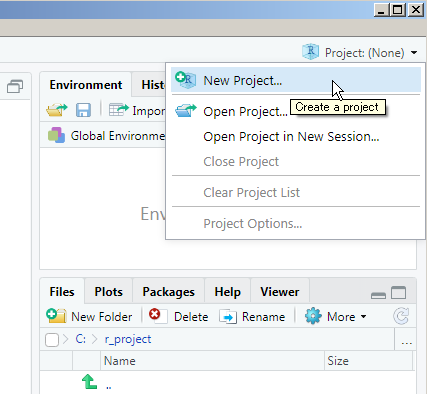

# 前提：プロジェクトの設定 {#project}

Rの基本的な使い方は他の情報源にゆだねていますが、ここだけは避けて通れないので解説しておきます。

## どのフォルダのファイルかの指定
excelファイルに限らず、ファイルをRに読み込む際は、どのフォルダから読むのか、位置を正確に指定する必要があります。

そこで重要となる概念が、「作業フォルダ」というものです。

コンソールに`getwd()`と打って出てくるフォルダが現在の作業フォルダになります。

## プロジェクトとは {#projecttoha}
RStudioの「プロジェクト」とは、作業フォルダにまつわる面倒な設定を意識しないですむ非常に便利な機能です。RStudioを開いて右上のところに設定アイコンがあります。

ざっくり説明すると、データを加工して解析する際に、1つのフォルダ（サブフォルダも含む）の中に関連するデータやコード、出力をまとめておき、そのフォルダをプロジェクトとして設定するのです。これにより、ファイルの読み書きの際の場所指定をいちいち意識しないで作業できるようになります。

したがって、本書に出てくる内容を自身のPC上で再現するには、https://github.com/izunyan/excel_r をダウンロードして、その中にある`excel_r.Rproj`ファイルを実行すればお手軽です。

詳しくは、先述のR for Data Scienceでの[解説](https://r4ds.had.co.nz/workflow-projects.html)が参考になります。^[https://r4ds.had.co.nz/workflow-projects.html]